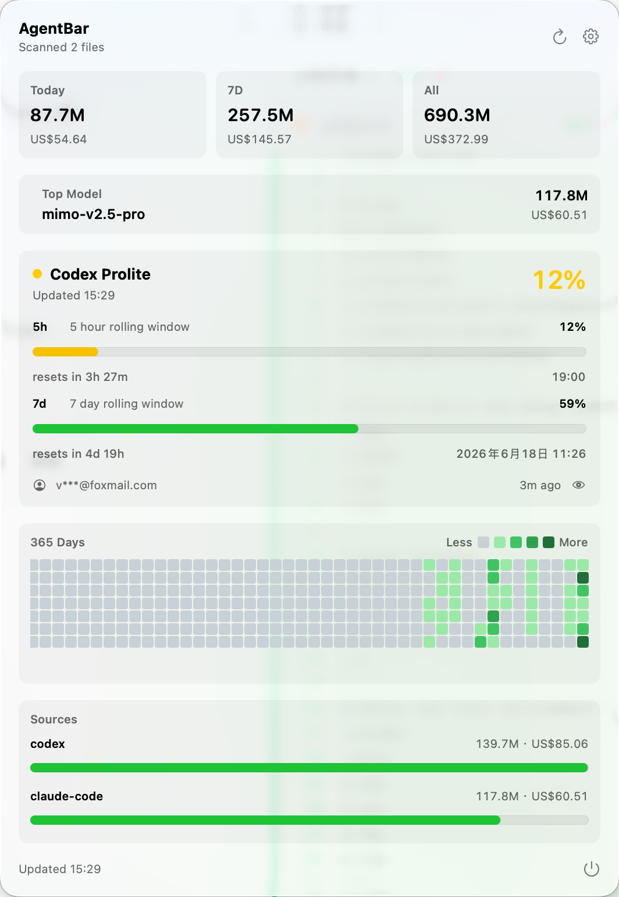
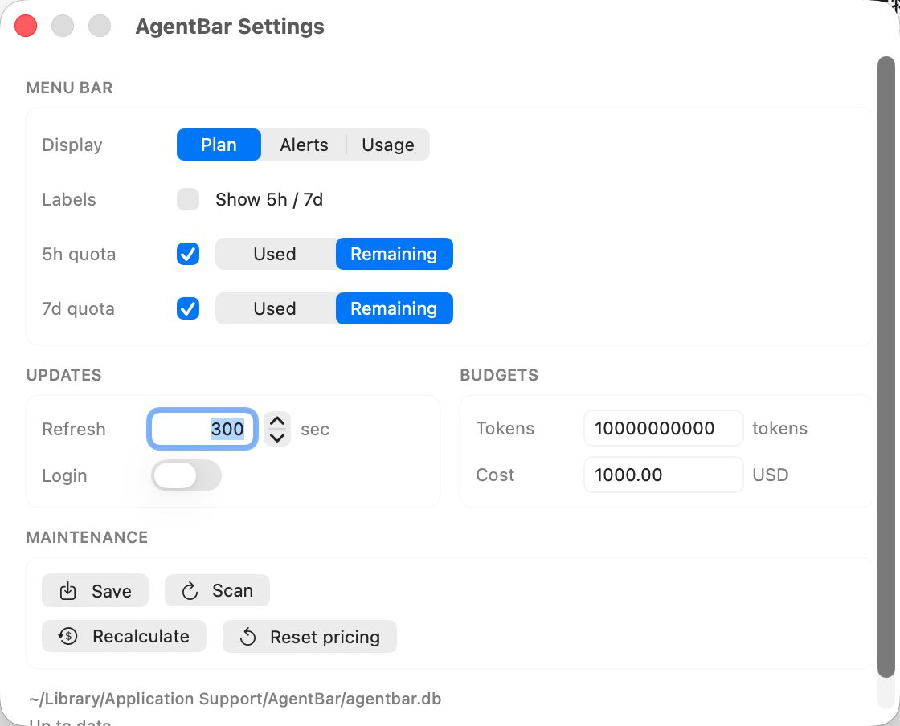

# AgentBar

[中文](README.zh-CN.md)

AgentBar is a macOS menu bar app for tracking local AI coding assistant usage. It scans local usage records, estimates token and cost totals, and shows quota progress directly in the menu bar.



## Highlights

- Menu bar quota indicators for 5-hour and 7-day rolling windows.
- Local usage summaries for today, 7 days, and all time.
- Source breakdowns for tools such as Codex and Claude Code.
- Pricing-based cost estimates with configurable budgets.
- Local-first data storage. Usage data is scanned and normalized on your Mac.


## Installation

### Download a GitHub release

1. Open the repository's **Releases** page.
2. Download `AgentBar-macos.zip` from the latest release.
3. Unzip it and move `AgentBar.app` to `/Applications`.
4. Launch the app. If macOS blocks the first run, open **System Settings > Privacy & Security** and allow it.

This repository includes a GitHub Actions workflow that builds the app and attaches the zip file whenever a version tag is pushed.

```bash
git tag v0.1.0
git push origin v0.1.0
```

### Install with Homebrew

After releases are published, AgentBar can be distributed through a tap:

```bash
brew tap varenyzc1/agentbar
brew install --cask agentbar
```

### Build from source

Requirements:

- macOS 14 or later
- Xcode command line tools
- Swift 5.9 or later

```bash
git clone https://github.com/varenyzc1/agentbar.git
cd agentbar
./build.sh
open .build/AgentBar.app
```

For local development:

```bash
swift test
./debug.sh
```

## Settings

AgentBar lets you choose what appears in the menu bar, configure refresh behavior, set token and cost budgets, and rescan or recalculate local usage data.



## How It Works

AgentBar reads local usage files produced by supported coding assistants, parses provider/model/token information, and stores normalized records in a local SQLite database. The app then aggregates those records into rolling windows and summary ranges, applies a pricing catalog for cost estimates, and renders the result in a lightweight SwiftUI menu bar interface.

Quota information is kept separate from local usage totals. When available, AgentBar can refresh quota state and cache it locally so the menu bar stays useful between updates.

## Repository Layout

```text
Sources/AgentBar/          SwiftUI app and menu bar UI
Sources/AgentBarCore/      scanning, parsing, storage, pricing, aggregation
Tests/AgentBarCoreTests/   core behavior tests
Scripts/build_app.sh       release app bundle builder
.github/workflows/         CI and release packaging
```

## Privacy

AgentBar is designed around local scanning and local storage. It does not need a server to calculate local usage summaries. Be careful when sharing screenshots because account names, usage totals, and quota timing may be visible.

## Contributing

Issues and pull requests are welcome. Before opening a PR, please run:

```bash
swift test
./build.sh
```

## License

Apache License 2.0. See [LICENSE](LICENSE).
